**Rapport de lab IAC 

 Objectif du laboratoire
L’objectif de ce TP est de comprendre le concept d’Infrastructure as Code (IaC) en mettant en place des machines virtuelles selon deux approches :
-  Approche impérative (Shell + Vagrant)
-  Approche déclarative (Ansible + Vagrant)
-  Mise en place d’un health check GitLab
- Analyse d’un service défaillant (bonus)

***Partie 1 – Approche Impérative avec Vagrant et Shell Provisioner***

L’objectif de cette première partie est de comprendre le principe de IAC à travers une approche impérative.
Nous avons utilisé Vagrant pour créer une machine virtuelle et le Shell Provisioner pour automatiser certaines configurations à l’intérieur de cette VM.

Dans notre cas, nous travaillons sur un Mac M2 (architecture ARM64).
Nous avons adapté la configuration en utilisant :
Une box ARM : perk/ubuntu-2204-arm64
Le provider : qemu
Vagrant pour l’orchestration de la VM

**Création de la Machine Virtuelle**

Vagrant.configure("2") do |config|
  config.vm.define "centos_server" do |server|

    server.vm.box = "perk/ubuntu-2204-arm64"

    server.vm.provider "qemu" do |qe|
      qe.ssh_port = "50022"
      qe.memory = 2048
      qe.cpus = 1
    end

    server.vm.provision "shell",
      inline: "echo Hello, World > /tmp/provision_test"

  end
end

### Démarrage de la VM : 

vagrant up --provider=qemu

## will check VMs status
```bash
vagrant status 

 stop the VMs

vagrant halt

 will destroy VMs 
vagrant destroy
```

### 3. Check that everything is ok by connecting to the VM via SSH

vagrant ssh : je suis rentrée à la VM 
cat /tmp/provision_test
cat /etc/hosts.   la connexion ssh est validée 

### 4. Play with different commands for Shell Provisioner
 ## Étape 1 – Modifier le Vagrantfile 

 server.vm.provision "shell",
  inline: "echo '127.0.0.1 mydomain-1.local' | sudo tee -a /etc/hosts"

## Étape 2 – Appliquer le provisioning
vagrant provision

Étape 3 – Vérifier dans la VM
vagrant ssh
cat /etc/hosts

part 2 : Enregistrer la date de provisioning
l'objectif de cette partie est de créer un fichier contenant la date du provisioning.
Cela permet de :
- Vérifier quand le provisioning a été exécuté
- Montrer que la VM est reproductible

Modification de vagrantfile
server.vm.provision "shell", inline: <<-SHELL
  echo I am provisioning...
  date | sudo tee /etc/vagrant_provisioned_at
SHELL

apres : 
vagrant provision
verfifictaion avec : 
vagrant ssh
cat /etc/vagrant_provisioned_at
 
 la reponse : nt ssh
cat /etc/vagrant_provisioned_at

Welcome to Ubuntu 22.04.5 LTS (GNU/Linux 5.15.0-143-generic aarch64)

 * Documentation:  https://help.ubuntu.com
 * Management:     https://landscape.canonical.com
 * Support:        https://ubuntu.com/pro

 System information as of Thu Feb 12 14:56:58 UTC 2026

  System load:           0.09
  Usage of /:            2.7% of 61.84GB
  Memory usage:          10%
  Swap usage:            0%
  Processes:             98
  Users logged in:       0
  IPv4 address for eth0: 10.0.2.15
  IPv6 address for eth0: fec0::5054:ff:fe12:3456


Expanded Security Maintenance for Applications is not enabled.

0 updates can be applied immediately.

Enable ESM Apps to receive additional future security updates.
See https://ubuntu.com/esm or run: sudo pro status


The list of available updates is more than a week old.
To check for new updates run: sudo apt update
New release '24.04.3 LTS' available.
Run 'do-release-upgrade' to upgrade to it.


Last login: Thu Feb 12 14:31:03 2026 from 10.0.2.2
vagrant@ubuntu:~$ 

***Part 2. Declarative - GitLab installation using Vagrant and Ansible Provisioner***

Nous allons configurer un serveur sous Linux pour installer et exécuter GitLab.

Nous utiliserons le provisionneur `ansible_local` (https://www.vagrantup.com/docs/provisioning/ansible_local.html) qui installera Ansible sur une machine virtuelle Linux générique (distribution `generic/rocky8`) créée avec Vagrant (https://www.vagrantup.com/). Ainsi, Ansible n'est pas nécessaire sur votre système d'exploitation hôte !

### 1. Prepare a virtual environment

Nous allons installer GitLab sur la machine virtuelle `generic/rocky8`. Lors de la première installation d'un nouveau logiciel dans un environnement de test, nous procédons manuellement pour tester chaque étape. Une fois le processus d'installation validé, nous l'automatisons à l'aide d'outils comme Vagrant et Ansible.

Nous irons dans le répertoire `lab/part-2` et consultez le fichier `Vagrantfile` ainsi que le fichier `playbooks/run.yml`.

Nous avons adapter le Vagrantfile pour qu’il fonctionne correctement sur l'environnement personnel (Mac M2, architecture ARM) :

- L’image generic/rocky8 est prévue pour x86_64 et ne fonctionne pas sur Apple Silicon. Je l’ai remplacée par perk/ubuntu-2204-arm64, compatible ARM et déjà testée dans la partie 1.
- VirtualBox est instable sur Mac M2 et VMware n’est pas installé. QEMU fonctionne correctement sur cette architecture, j’ai donc configuré Vagrant pour l’utiliser comme provider.
- Le private_network avec IP fixe est surtout utilisé avec VirtualBox/VMware. Avec QEMU, ce n’est pas nécessaire puisque l’accès à GitLab se fait via un port forward (localhost:8080).
- config.vm.synced_folder était inutile : Vagrant monte déjà automatiquement le projet dans /vagrant, ce qui suffit pour Ansible (ansible_local lit directement les playbooks depuis ce dossier).

### 2. Create and provision a virtual machine (VM)

On va donc ici utiliser la commande "vagrant up" 

Voici les captures d'écran des commandes et résultat obtenu :


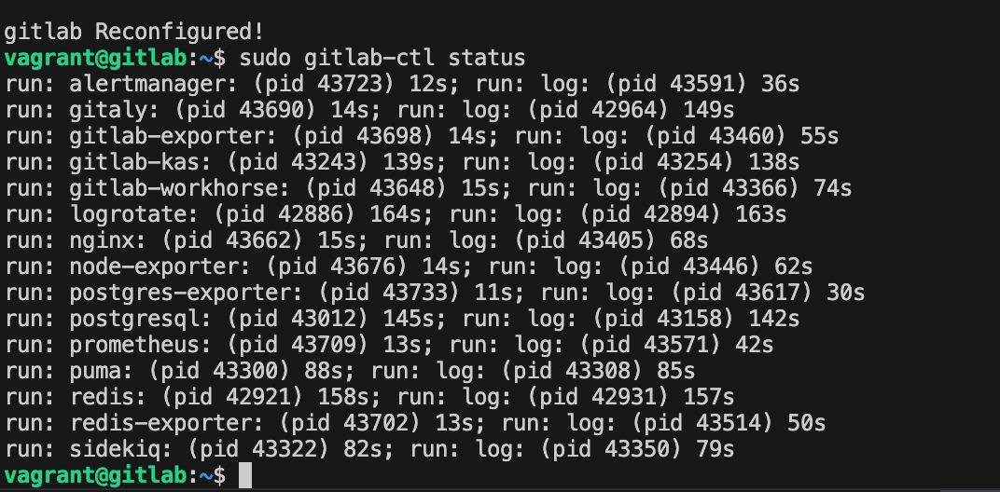
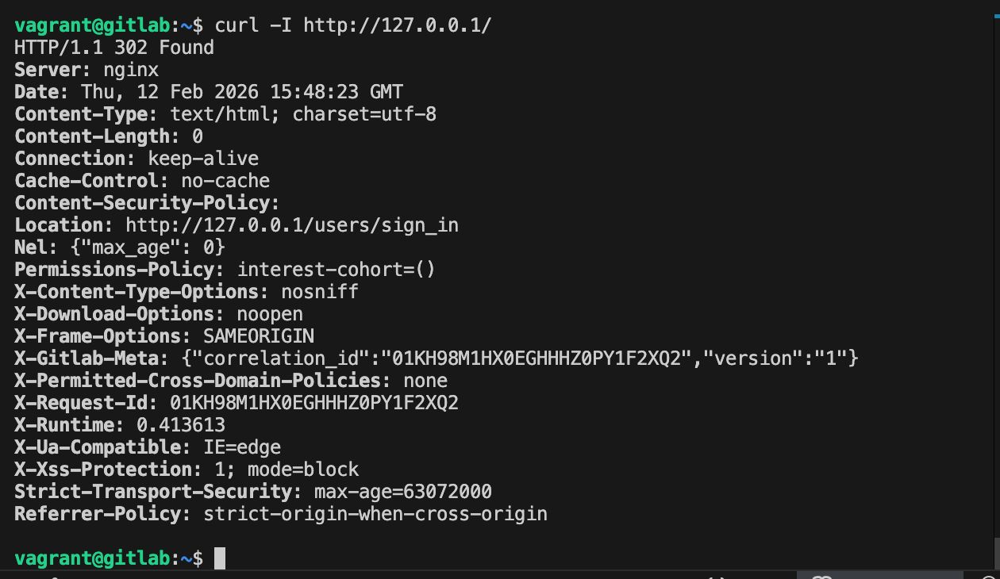
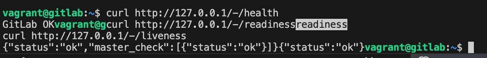

### 3. Test the installation 

Pour valider l’installation, nous avons vérifié que les services GitLab sont actifs avec sudo gitlab-ctl status (nginx, postgresql, redis, puma, sidekiq, etc.). Ensuite, nous avons testé la réponse HTTP locale via curl -I http://127.0.0.1/ et validé le endpoint de supervision /-/health retournant GitLab OK. Ces contrôles confirment que GitLab est correctement déployé et opérationnel sur la VM


L’installation de GitLab a été validée par l’accès à l’interface web via http://localhost:8080. L’authentification avec l’utilisateur root et le mot de passe généré automatiquement confirme que l’application est correctement déployée et opérationnelle.

### 4. Instructions for updating playbooks

Si on doit modifier l'installation, nous devons modifier les playbooks, les charger sur les machines virtuelles et exécuter le provisionnement avec les commandes :

- vagrant rsync
- vagrant provision

## Part 3. Declarative - Configure a health check for GitLab

1.  Read the [GitLab Health Check doc] 
2. Run a health check using `curl`:
  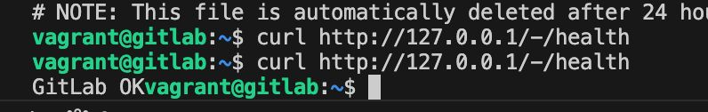
  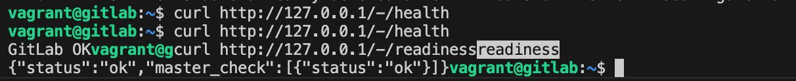

3. Read [`lab/part-2/playbooks/roles/gitlab/healthchecks/tasks/main.yml`]

4. Run the `gitlab/healthcheck` role:
  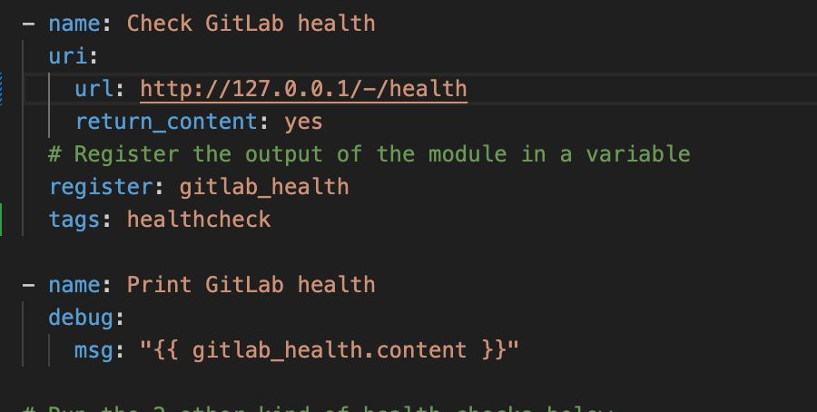
  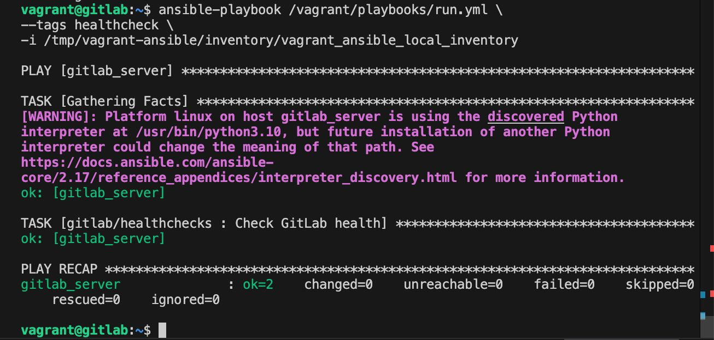

5. Run the 2 other kinds of health checks in the playbook (using the [uri module](https://docs.ansible.com/ansible/latest/modules/uri_module.html)):
  - [Readiness check]
  - [Liveness check] :
        

6. Print the results of the health checks in the console.
  

## Bonus task

L'objectif est d'affichez un message personnalisé indiquant uniquement les services dysfonctionnels détectés lors du contrôle de disponibilité, le cas échéant. Pour tester l'affichage, arrêtez `redis` sur le nœud à l'aide de la commande `sudo gitlab-ctl stop redis` avant de relancer le playbook. Conseil : utilisez l'attribut `json` de la réponse.
  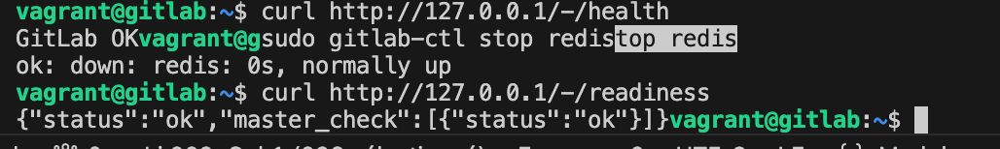
  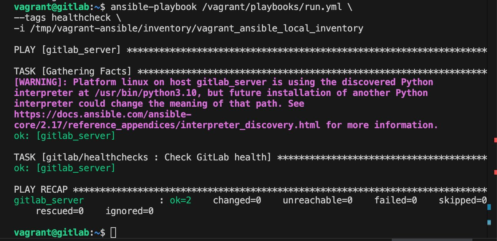
  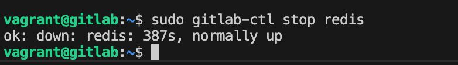
  Modification du main de Yaml 
  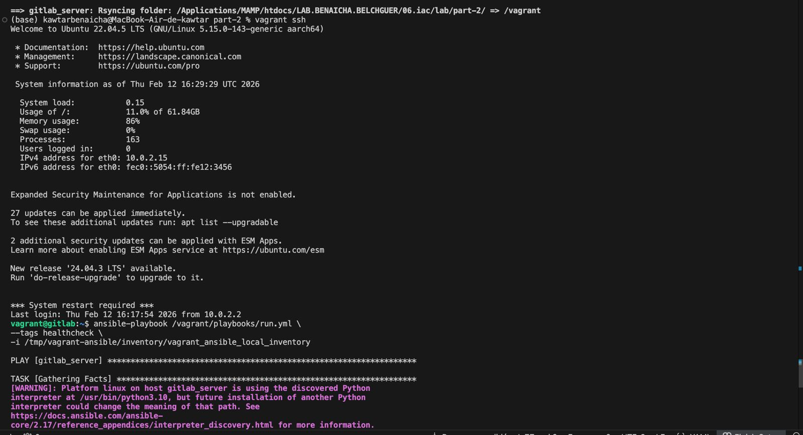
  Redis
  


