# Lab

Container orchestration with Kubernetes

## Objectives

1. Install Minikube
2. Learn to use `kubectl` commands
3. Learn to expose a Kubernetes service to the outside
4. Learn to scale up and down a Kubernetes deployment
5. Run a multiple pod application in Kubernetes
6. Deploy an app using Manifest yaml files

## 1. Install Minikube

Script terminal :
 minikube start
😄  minikube v1.38.1 sur Microsoft Windows 11 Home 25H2
✨  Choix automatique du pilote docker. Autres choix: hyperv, virtualbox, ssh
❗  Starting v1.39.0, minikube will default to "containerd" container runtime. See #21973 for more info.
📌  Utilisation du pilote Docker Desktop avec le privilège root
👍  Démarrage du nœud "minikube" primary control-plane dans le cluster "minikube"
🚜  Extraction de l'image de base v0.0.50...
💾  Téléchargement du préchargement de Kubernetes v1.35.1...
    > preloaded-images-k8s-v18-v1...:  272.45 MiB / 272.45 MiB  100.00% 3.83 Mi
    > gcr.io/k8s-minikube/kicbase...:  519.58 MiB / 519.58 MiB  100.00% 4.38 Mi
🔥  Création de docker container (CPU=2, Memory=4000Mo) ...
🐳  Préparation de Kubernetes v1.35.1 sur Docker 29.2.1...
🔗  Configuration de bridge CNI (Container Networking Interface)...
🔎  Vérification des composants Kubernetes...
    ▪ Utilisation de l'image gcr.io/k8s-minikube/storage-provisioner:v5
🌟  Modules activés: storage-provisioner, default-storageclass
🏄  Terminé ! kubectl est maintenant configuré pour utiliser "minikube" cluster et espace de noms "default" par défaut.
PS C:\Users\ayyub> minikube status
minikube
type: Control Plane
host: Running
kubelet: Running
apiserver: Running
kubeconfig: Configured

### Commenetiare : 
Nous avons démarré un cluster Kubernetes local avec Minikube en utilisant le driver Docker. La commande minikube status a permis de vérifier que le cluster était bien actif.

## 2. Learn to use `kubectl` commands

2. Run a `deployment` with one `pod` with the following command:
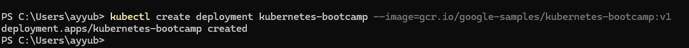

Commentaire
Cette commande crée un Deployment appelé kubernetes-bootcamp à partir d’une image Docker contenant une petite application Node.js.

3. List all the running pods with:
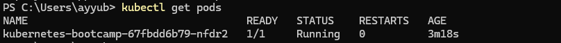
La commande kubectl get pods a permis de vérifier que le pod associé au déploiement était bien créé et en cours d’exécution.

4. Display the pod logs with:

Cette commande affiche les logs produits par l’application à l’intérieur du pod.

5. Run a command inside the pod with:
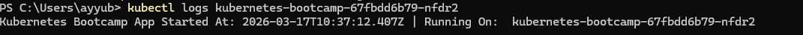

Nous avons utilisé kubectl exec pour lancer une commande dans le conteneur et observer le système d’exploitation utilisé par l’image Docker.

6. Open a shell inside the pod with:
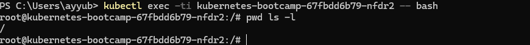

Nous avons ouvert un shell interactif dans le conteneur afin d’explorer son contenu et d’identifier les fichiers de l’application.

7. List the content of the directory you are in and try to find the JavaScript source code file

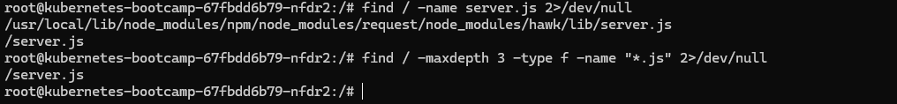

le fichier JavaScript de l’application n’est pas dans la racine / mais dans la racine du conteneur.

8. Make sure that the web app is responding inside the container by querying it with `curl`

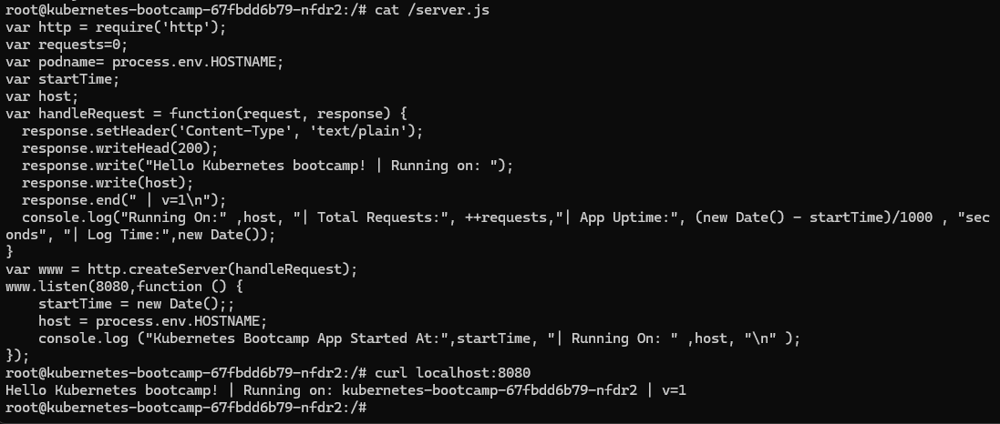

9. Are you able to query the web app outside of the pod (from your local machine)?

Non, il n’est pas possible de joindre l’application depuis l’extérieur du pod tant qu’aucun service n’a été créé pour l’exposer.

## 3. Learn to expose a Kubernetes service to the outside

1. Expose the deployment you created in the first part of the lab with:
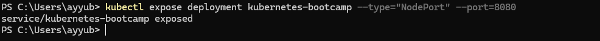

2. Find out on which port the service has been attached with:
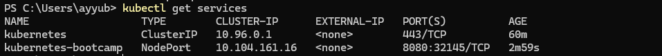
8080 correspond au port interne du pod
32145 correspond au port externe attribué par Kubernetes

3. Get the IP of your Minikube VM with:
L'ip de mon noeud Minikube est : 192.168.49.2

4. Using the answers of questions 2 and 3, open your web browser and try to reach the web app.
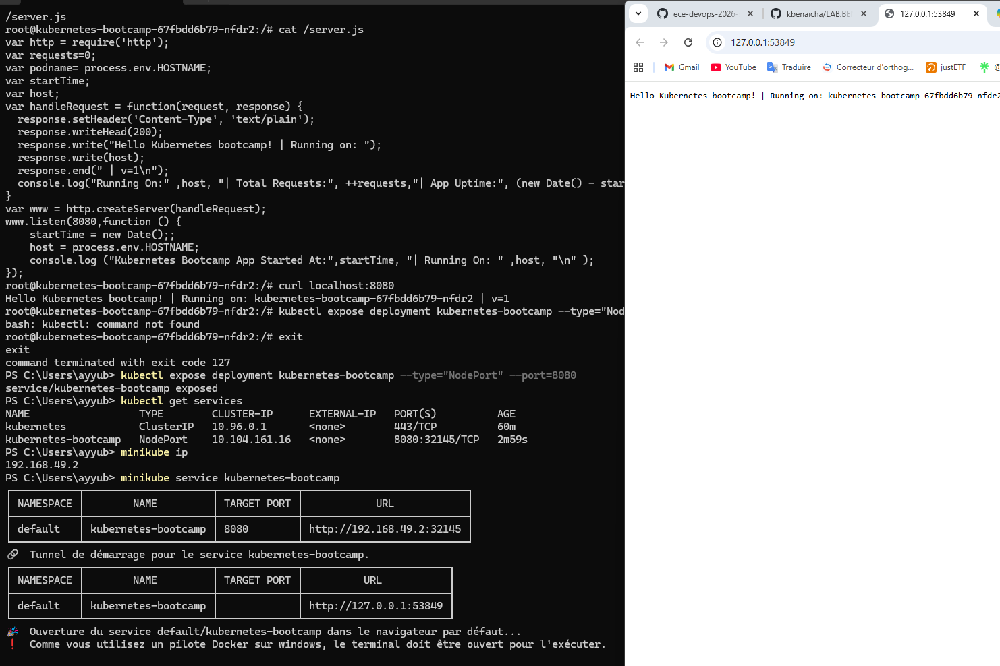

## 4. Learn to scale up and down a Kubernetes deployment
1. Scale up to 5 pods
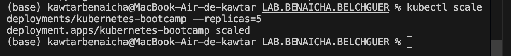

Nous avons augmenté le nombre de réplicas à 5 afin d’observer le comportement d’une application déployée sur plusieurs pods.

2 Make sure you have 5 pods running. Which command did you use?
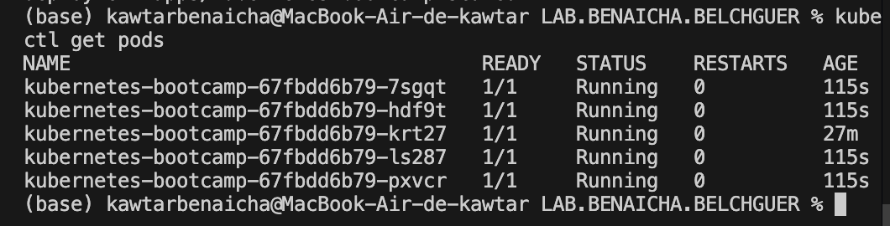

Pour vérifier la présence de 5 pods actifs, nous avons utilisé la commande kubectl get pods.

3. Open the exposed service again and force refresh. What is happening? Why?

En rechargeant la page plusieurs fois, nous avons constaté que les requêtes étaient distribuées entre plusieurs pods. Cela s’explique par le mécanisme de load balancing assuré par le service Kubernetes.

4. Scale down again to 2 pods and confirm the other 3 are not running anymore

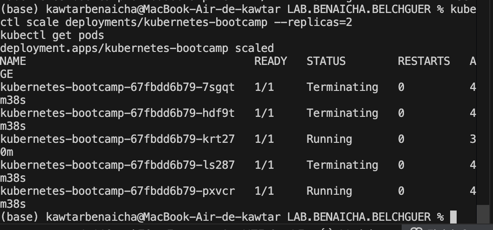

Après réduction à 2 réplicas, Kubernetes a automatiquement supprimé les trois pods excédentaires afin de revenir à l’état désiré.

## 5. Run a multiple pod application in Kubernetes
2. Update the Docker image to v2
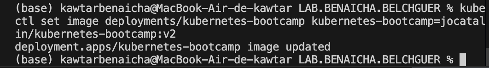
3. What happened to the web page?

Lors de l’actualisation de la page, nous avons observé un changement progressif du contenu. Cela s’explique par le rolling update, qui remplace les pods de manière graduelle.

4. Update the image again to v3
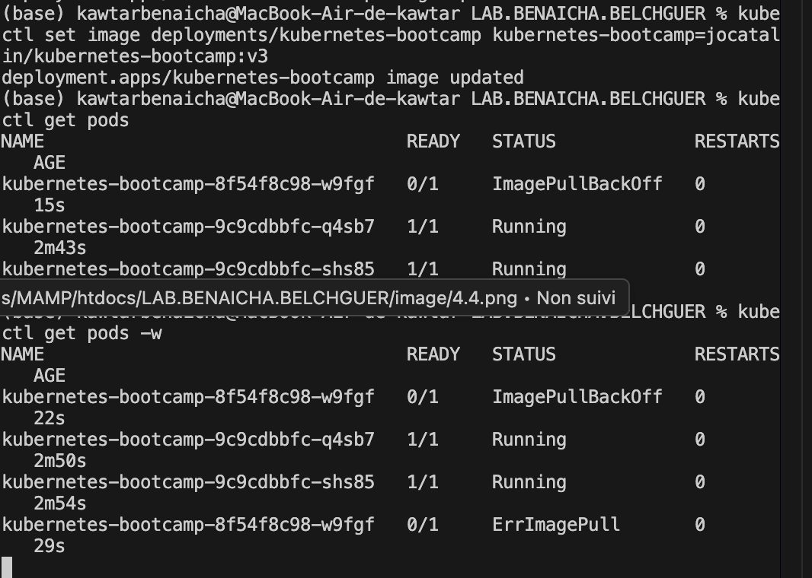

Après tentative de mise à jour vers v3, nous avons observé un comportement anormal des pods, certains n’arrivant pas à démarrer correctement. Cela montre le comportement de Kubernetes lorsqu’une image déployée est invalide 

5. Cancel the previous operation
kubectl rollout undo deployments/kubernetes-bootcamp
Cette commande annule la dernière mise à jour.

6. Roll back the service to the image we first chose in part 2
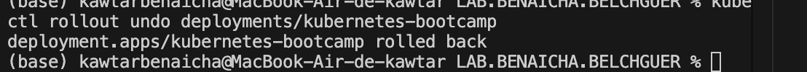

## 6. Deploy an app using Manifest yaml files
1. Clean up previous resources
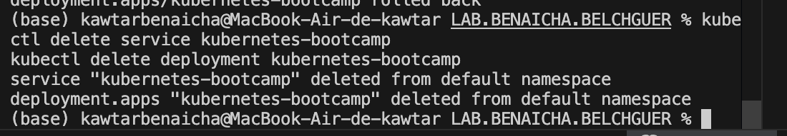

Nous avons supprimé le service et le déploiement existants afin de repartir d’un environnement propre avant d’utiliser des manifestes YAML.

2. Fill out deployment.yaml

/../lab/deployment.yaml
3. Apply the deployment file
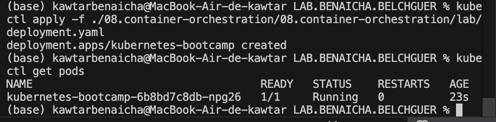

Après application du fichier deployment.yaml, les pods ont bien été créés et ont démarré correctement.

5. Apply the service file 
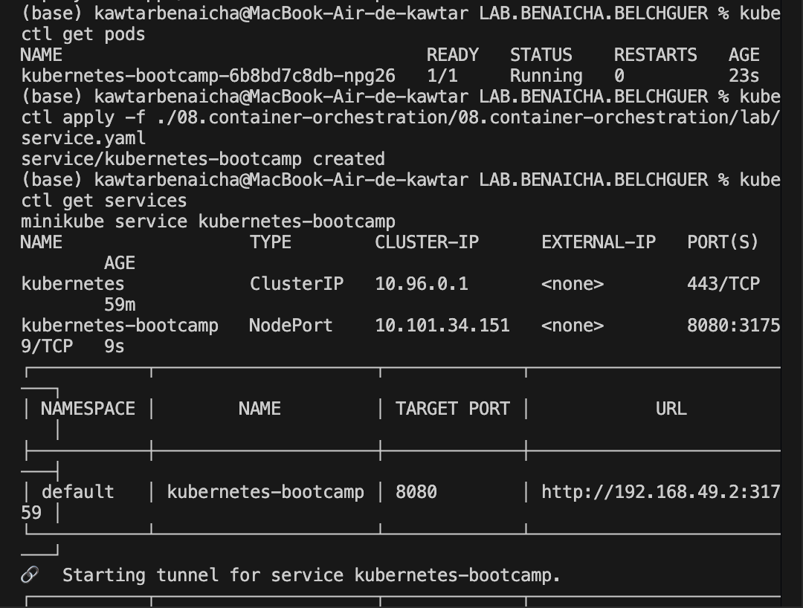

Après application du service YAML, l’application est devenue accessible depuis le navigateur grâce au service exposé par Minikube.

6. Fill out TO COMPLETE #2 inside deployment.yaml to create 3 replicas

on modifie le nombre de réplices de 1 par  3 
7. Apply the updated deployment
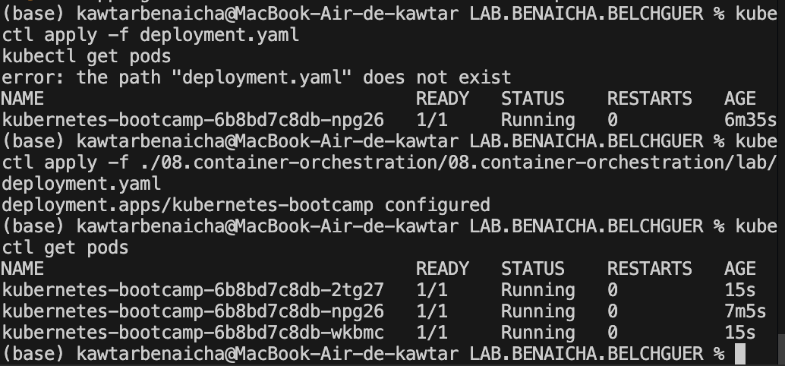
Après passage à trois réplicas, nous avons constaté en rechargeant la page que les requêtes étaient réparties entre différentes instances de l’application.
8. Clean up the cluster and stop Minikube
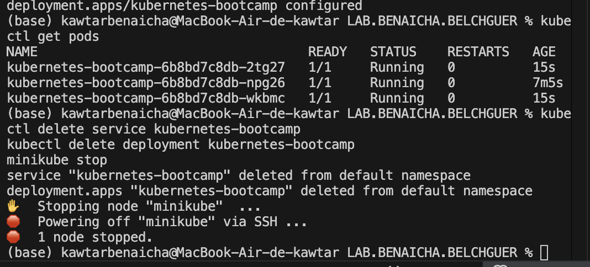

Ces commandes suppriment les ressources et arrêtent Minikube.